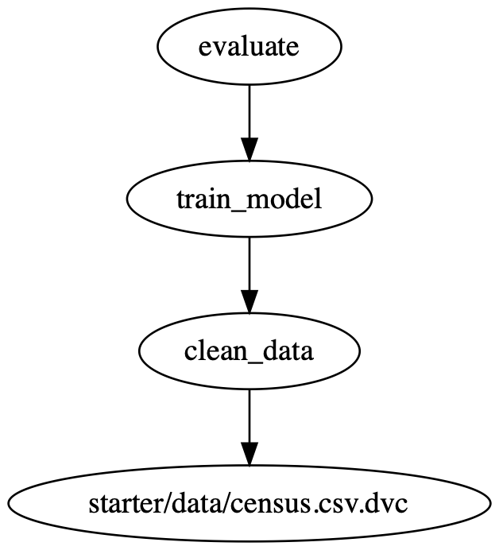

[](https://github.com/marcusholmgren/machine-learning-on-census-with-fastapi/actions/workflows/python-package-conda.yml)

# Machine Learning on census data with FastAPI

This project is a demonstration of how to use FastAPI to create a REST API for a machine learning model.
The project uses DVC to manage the project dependencies and allow for a reproducible ML pipeline.

## Tech Stack

[Python](https://www.python.org), [DVC](https://dvc.org), [scikit-learn](https://scikit-learn.org/stable/), 
[pandas](https://scikit-learn.org/stable/), [FastAPU](https://fastapi.tiangolo.com) and [Conda](https://docs.conda.io/en/latest/)


## DVC Dag



The DVC pipeline can also be viewed in the terminal with the command:
```cli
dvc dag
```
Output
```
+-----------------------------+  
| starter/data/census.csv.dvc |  
+-----------------------------+  
                *                
                *                
                *                
        +------------+           
        | clean_data |           
        +------------+           
                *                
                *                
                *                
        +-------------+          
        | train_model |          
        +-------------+          
                *                
                *                
                *                
          +----------+           
          | evaluate |           
          +----------+                   
```

# Environment Set up

The `Makefile` contains the commands to set up the environment for the project. 
This will create a conda environment and install the dependencies.
If you prefer `pip` to install the dependencies, you can use the `requirements.txt` file.

# Notes from the project

The commands bellow are more or less the same as the ones used to create the project. 
They are note important to clone and run the project.

Initialize and start using [dvc](https://dvc.org/) inside git repository.
```
dvc init
```

Start to track the [UCI census](https://archive.ics.uci.edu/ml/datasets/census+income) data file.
```
dvc add starter/data/census.csv
```

Store file in AWS S3 bucket
```
dvc remote add -d storage s3://<name-of-s3-bucket>
```

Tell dvc to use the AWS profile named udacity, instead of the default profile.
```
dvc remote modify storage profile udacity
```

Run the `clean_data.py` script 
```
dvc run -n clean_data -d starter/data/census.csv -d starter/starter/clean_data.py -o starter/data/census_clean.csv --no-exec python starter/starter/clean_data.py
```

DVC pipeline can be run with `dvc repro` command.

### Deploy the project

Create Heroku application
```cli
heroku create marcus-census-fastapi --buildpack heroku/python
```

set git remote heroku to https://git.heroku.com/marcus-census-fastapi.git
```cli
heroku git:remote --app marcus-census-fastapi
```

Add extra buildpack layer for DVC, also see `Aptfile`
```cli
heroku buildpacks:add --index 1 heroku-community/apt
```

Run git push heroku main to create a new release using these buildpacks.
```cli
git push heroku main
```

Add AWS configuration keys
```cli
heroku config:set AWS_ACCESS_KEY_ID=xxx AWS_SECRET_ACCESS_KEY=yyy
```

[DVC on Heroku](https://ankane.org/dvc-on-heroku) article by Andrew Kane.
