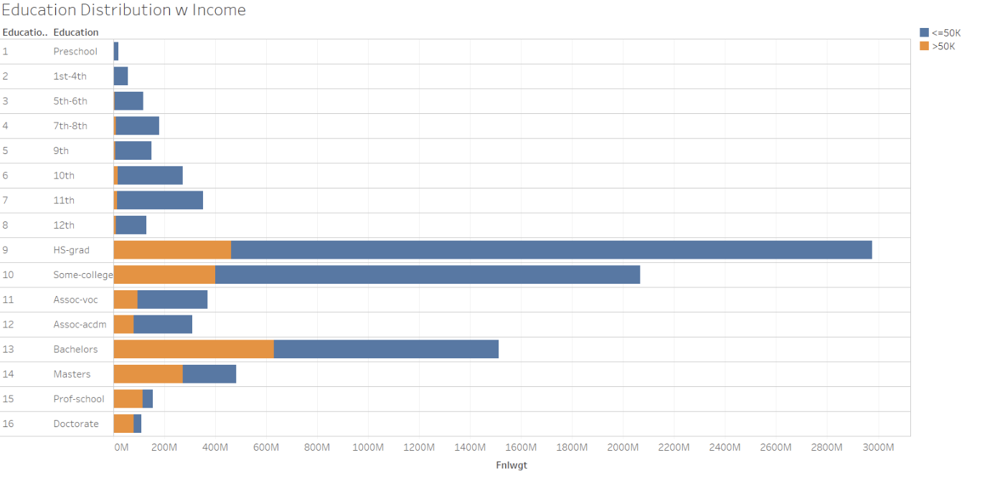
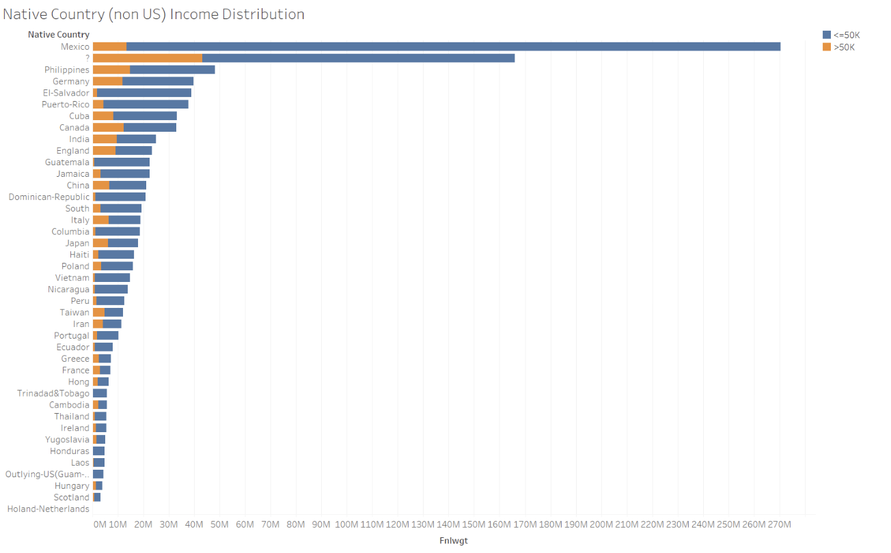
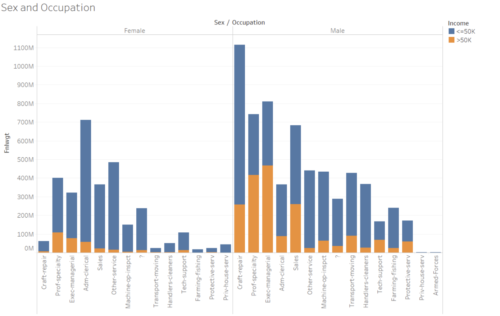

# Model Card

## Model Details

### Overview

This is a logistic regression model which aims to classify whether or not an individual has an income of over $50,000 based on various demographic features. This model is trained on the UCI Census Income Dataset. This is not a production model and only used for research purposes. In this Model Card, you can review quantitative components of the model's performance and data, as well as information about the models's intended uses, limitations and ethical considerations.

### Owners

+ nguyentuanhieptuki@gmail.com

## Intended Use

This is a model used for research purpose only. Prediction task is to determine whether a person makes over 50K a year.  

## Training and evaluation Data

Data was downloaded from https://anvilproject.org/guides/content/creating-links.
This data was created by Barry Becker from the 1994 Census database.  
Prediction task is to determine whether a person makes over 50K a year.  
Train data and evaluation data was split by using `sklearn.model_selection.train_test_split` function with 20% for evaultion data, 80% for train data.  
The graphes below show some informations about the dataset:  

## Metrics

Based on validation data, this model's performance is measured by following metrics:
+ precision: 0.718
+ recall: 0.269
+ fbeta: 0.391

